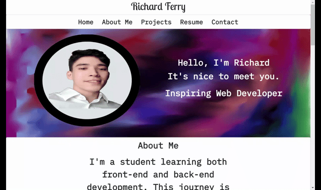

# portfolio-ii [](https://opensource.org/licenses/MIT)

## Description
The following application is a portfolio that includes one of my recent projects and two individual projects. All in which display my potential as a Web Developer. For this project I used a custom background image. One that is designed using Krita painting software.
<br></br>


## Features 
* Responsive Design
* Links to projects
* Navigation bar for quick access to sections

  

```
body{
background-image: url("./images/portfolio-background.jpg");
background-attachment: fixed;
}
```
This piece of code played a crucial role to inserting the background image. With the fixed attribute added the content glides across the background.

## Technologies
* HTML/CSS
* Bootstrap
* krita painting 

## Instructions
A quick walk-through to download the application. Once Installation is complete the file can be edited to include different images or text.

### Requirements
* IDE capable of running HTML, CSS.
* Web browser(preferrably chrome).

### Installing
* clone the SSH from github.
* open the html file in browser of your choice.

### Live Deployment
* [CLICK HERE](https://rich-f-p.github.io/portfolio-ii/)

### Richard Ferry
* [LinkedIn](https://www.linkedin.com/in/richard-ferry-83120514b/)
* [Github](https://github.com/rich-f-p)
* [email](mailto:richardfpro864@gmail.com)

### Credits
* google fonts
* bootstrap
* Krita painting

### License
* [License: MIT](https://opensource.org/licenses/MIT) : click to learn more
